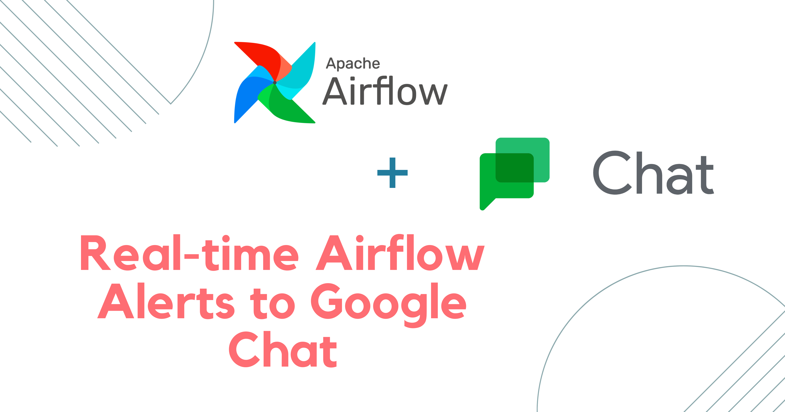
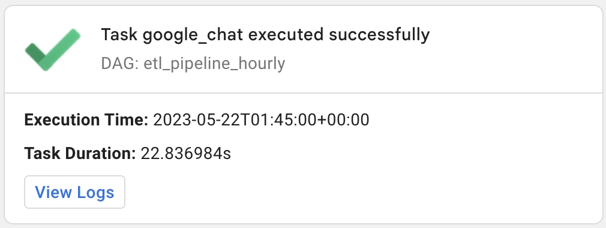

# Airflow Google Chat Integration
### Send airflow dag task sucess and failure alerts to google chat 
This repository is created for my medium article. <br>
Read Complete Article: https://kashif-sohail.medium.com/real-time-airflow-alerts-to-google-chat-b443ec7487cc
<br>


## Steps
Create a Google Chat Space and Webhook
- Log in to your Google account and navigate to Google Chat.
- Create a new space or select an existing one where you want to receive the Airflow alerts.
- Click on the space name, click on apps and integrations, and click the "Manage webhooks" button.
- Provide a name for the webhook and Avatar URL and then click "Save"
- Copy the generated webhook URL as we will use it in the next step.

## Adding Webhook details to airflow
- Implementing a best practice, it is crucial to store credentials securely by adding them to the airflow connections. To achieve this, follow these steps:
- Access the Airflow Web UI.
- Navigate to the Connections Page.
- Add a New Connection.
- In the host section, paste the webhook URL (excluding the key), and add the key to the password box.

`For the purpose of this tutorial, a connection named 'gchat_webhook' has already been added.`

## Example usage in DAG

``` 
from google_chat_callbacks import task_fail_alert, task_success_alert

task1 = PythonOperator(
    task_id='task1',
    python_callable=your_task1_function,
    on_success_callback=task_success_alert,
    on_failure_callback=task_fail_alert,
    dag=dag
)


```

## Success Alert Card


## Failure Alert Card


